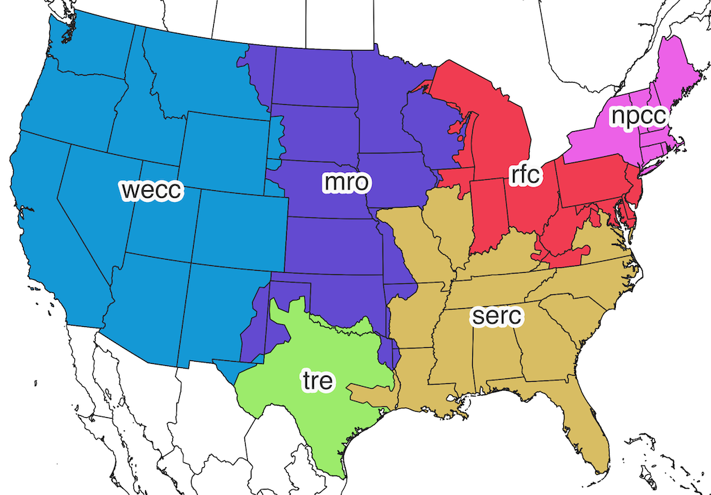

# nerc-regions

This repo documents the construction of a map of [NERC regions](https://www.nerc.com/AboutNERC/keyplayers/Pages/default.aspx) (USA only) after the decision to [dissolve the SPP](https://www.spp.org/newsroom/press-releases/southwest-power-pool-to-dissolve-regional-entity-focus-on-regional-transmission-organization-functions/). This repo was created to support the [geographical data system](https://geography.ecoinvent.org/) of the [ecoinvent database](https://www.ecoinvent.org/).

The resulting NERC region geopackage is [available for download](https://github.com/cmutel/nerc-regions/raw/master/data/output/nerc_regions.gpkg).

**Note**: NERC regions do not have exact or discrete boundaries. The data system of ecoinvent assumes perfect boundaries and no overlaps, but this is a system construct, not a reflection of the real world, which is messier. Use the maps produced here with caution.

## GIS data for NERC regions

The notebook [Comparing maps](https://github.com/cmutel/nerc-regions/blob/master/Comparing%20maps.ipynb) shows multiple possible input data sets for NERC regions (including SPP). After analyzing their strengths and weaknesses, a hand-traced map previously used in the ecoinvent database was selected, as this was as good as the other possibilities, and had an open license.

## Partitioning SPP

The notebook [Partitioning SPP](https://github.com/cmutel/nerc-regions/blob/master/Partitioning%20SPP.ipynb) shows how the SPP territory was dissolved and allocated to MRO, SERC, TRE, and WECC. We partitioned based on the data in the 218 eGrid database. This approach is limited by the input data, as there are no clear boundaries between the regions. The initial idea was to use [Voronoi tessellation](https://en.wikipedia.org/wiki/Voronoi_diagram), but this produced weird artifacts. Instead, I used a weighted K nearest neighbors classifier from [scikit-learn](https://scikit-learn.org/stable/modules/neighbors.html) to get smoother boundaries, and then hand-traced these boundaries, using my own judgment to avoid the creation of "islands" or other weird artifacts.

## Creating the new NERC regions

The notebook [Construct NERC regions from cutouts and Natural Earth](https://github.com/cmutel/nerc-regions/blob/master/Construct%20NERC%20regions%20from%20cutouts%20and%20Natural%20Earth.ipynb) shows how NERC regions were built up using various GIS "cutout" geometries and [shapely](https://shapely.readthedocs.io/en/latest/manual.html) GIS operations.

## License

The code is licensed BSD 3-clause, the data is licensed CC0.
